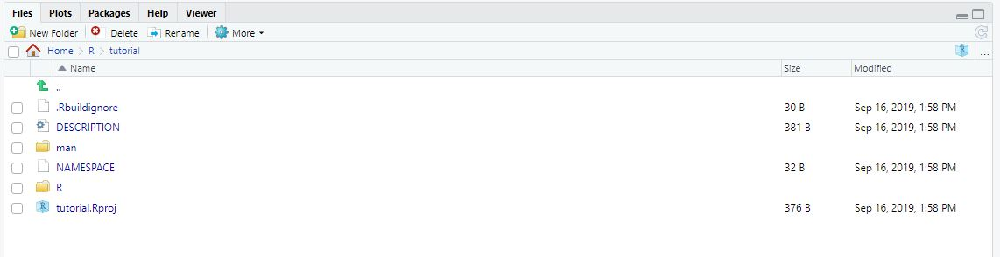

# Handleiding creëren en delen eigen R package in RStudio.
Fré Vink

Leer zelf een R package maken en delen binnen je team.

## Waarom zou je dit willen?
Als je gebruik maakt van RStudio ben je vast bekend met het gemak dat externe packages bieden.
Naast dat je veel functies zelf niet meer hoeft te schrijven, is ook de documentatie van de functies makkelijk te lezen.
Wanneer je in de console `?` gevolgd door de functienaam typt, verschijnt de functiedocumentatie vanzelf in het help scherm van RStudio.
Hier kan je lezen waar de functie voor bedoeld is, hoe deze werkt, welke variabelen je moet meegeven en hoe de resultaten eruit zien.
Je kan hierdoor meteen aan de slag met de functie, zonder dat je de code die voor de functie is gebruikt eerst moet doornemen.

Wanneer je zelf een functie schrijft weet je meestal precies hoe je deze moet gebruiken, maar als de functie wil delen met collega's zal je de functie van duidelijke comments moeten voorzien om er zeker van te zijn dat ze weten hoe ze met de functie moeten werken.
Het zou echter veel mooier zijn als je je functie kan delen binnen een package, waarbij je collega's via de help feature meteen kunnen zien hoe ze een functie moeten gebruiken.
Dit is een stuk makkelijker en minder werk dan je zou denken.
Als je je code toch al van comments voorziet is het een kwestie van een beetje structuur aanbrengen in je comments, waarna je je functie(s) in de package kan delen, voorzien van documentatie.

Er is heel veel zelf in te stellen bij het maken van een package. 
Zo kan je de documentatie van je package los van je comments van je code maken.
We zullen ons hier beperken tot een simpele configuratie waarbij de documentatie automatisch wordt aangemaakt op basis van je R code.

## Stap 1: Een nieuw project aan maken
Creëer in RStudio een nieuw project, kies ‘New Directory’, en vervolgens ‘Create R Package’.
Wanneer je nieuwe project geopend is zie je dat er meteen een aantal bestanden zijn aangemaakt.
